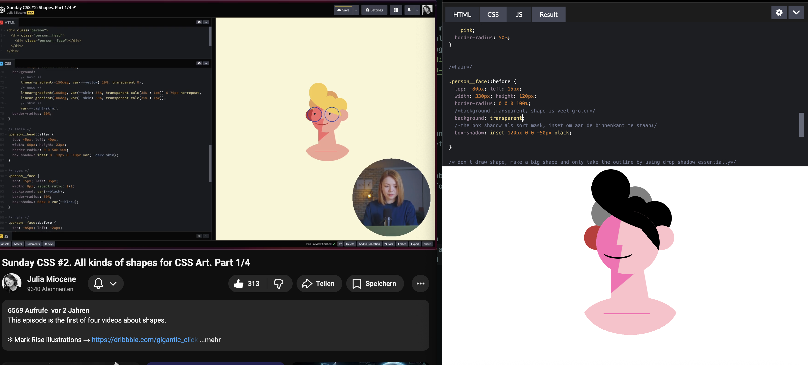
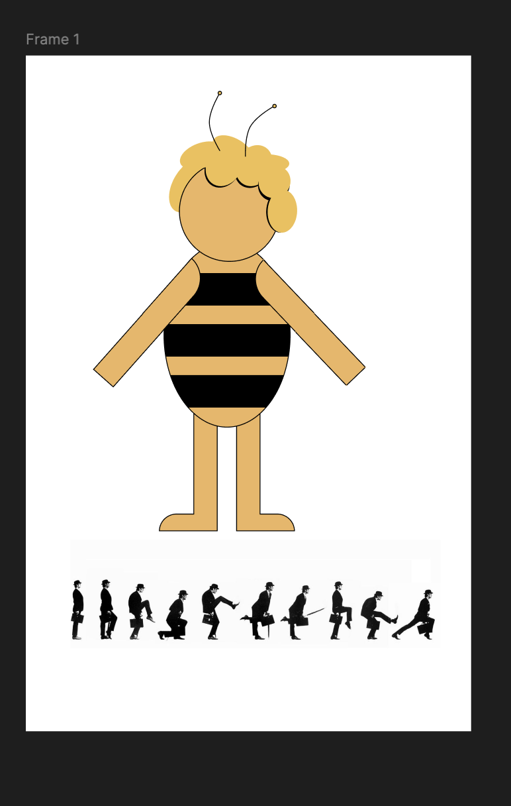
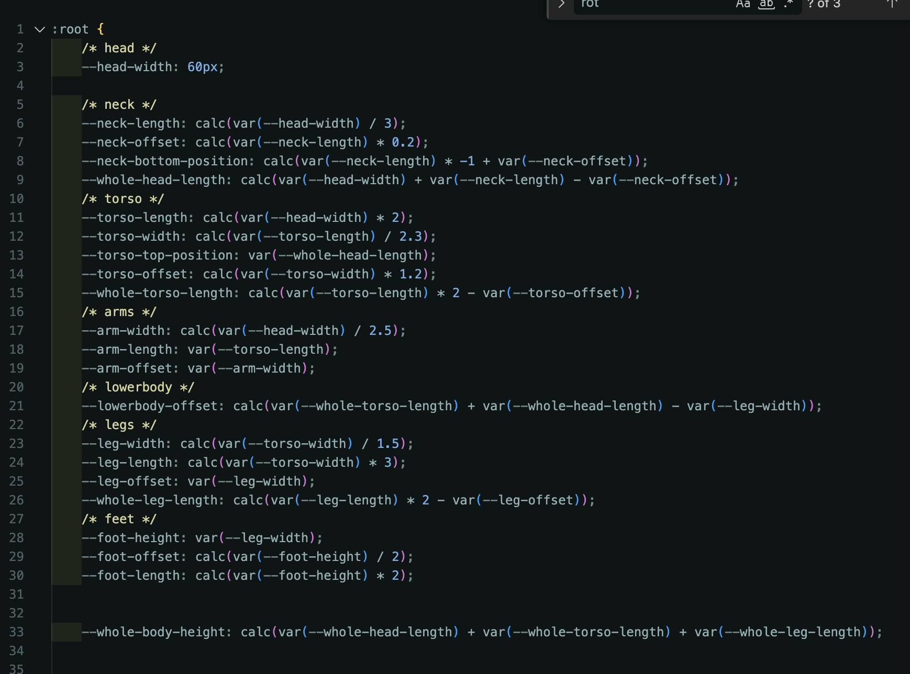
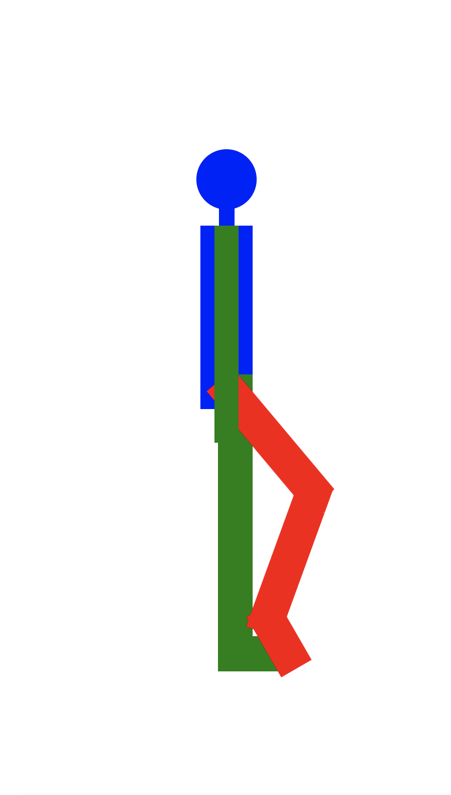
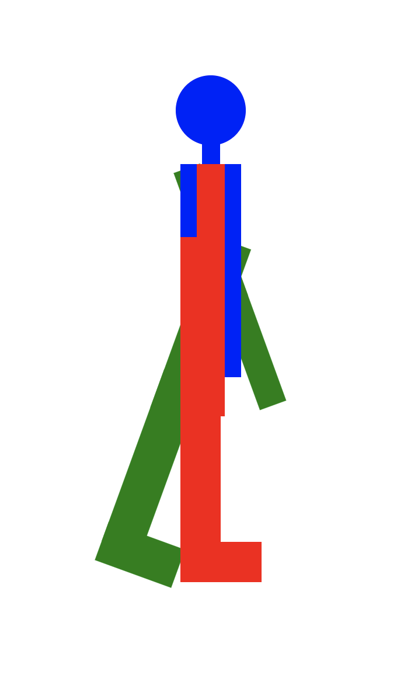

# CSS
## Week 1
### Introduction exercise
What did I do today?
- I read up on scroll animations and made my section of the website of my team. There I animated clouds on scroll to translateX, the sun on scroll on a path and the birds to loop flying on a path. I also added a text gradient animation on the heading of my section.

How long did it take?
- The whole day, 7 hours

What did I learn?
- How to actually use scroll driven animation, a little bit about animation-timing-functions and also that scroll animation is really hard to get right

What will I do tomorrow?
- Add some finishing touches, think about how to explain the code I wrote and what would be interesting to people. Merge all branches together for the website.

### Day 1
What did I do today?
- Presentation about the introduction exercise
- I chose the silly walk as my final assignment, so I followed a tutorial by Julia Miocene because I want to learn to make CSS illustration and animations like her

- Then I thought about that I wanted to make a silly walk with a character from an animated series I watched in my childhood. I wanted to use Maja the Bee so I made her in Figma to see how I would make her out of different CSS blocks

How long did it take:
- The whole day

What did I learn?
- How to make an HTML illustration with just divs and using different background colors and box shadows. I didn't even know you could use more than 1 box-shadow.

What will I do tomorrow?
- Try to make Maja the Bee in CSS to start animating it

### Weekly checkout 
This week I learned a lot during the introduction exercise. I already did Cyd's workshop on scroll animations but this was the first time I actually used it. And it turns out, it's quite hard! I struggled a lot to actually get things to look the way I want it them to look. I suppose I'll have to spend more than one day to actually understand the animation timelines. 
Other than that I didn't start on my code yet for the final exercise but I am happy with my idea. I'll make Maja the Bee in CSS and then make her walk silly! I think other than the animation my biggest challenge will building my Maja from CSS and actually making her look nice.

## Week 2
### Day 2
What did I do today?
- I spend the whole day on making the outline for my skeleton in CSS. I had already made an HTML outline, and I went off of that in my CSS. I tried to work with variables, that would make the body stay in ratio to itself. I also decided that I would use basic shapes first and then do the actual design of Maja the Bee later.

- When I finally had my whole body outlined, I already tried to see if I could move the body the way I wanted to. I didn't animate yet but I just used  transform: rotate(); to move one leg. I realized that my initial layout didn't quite work so I spent quite some time rearraging divs so they would move together. I hope I can leave it like this now.

How long did it take:
- The whole day

What did I learn?
- How to nest properly when animating a whole skeleton

What will I do tomorrow?
- Try to work more on actually making it look like Maja the Bee and then start animating

### Day 3 
What did I do today?
- I thought I figured out how to do the structure of the skeleton, but when I transformed elements, my z-index structure broke. I asked Nils about it, and apparently I have to redo my whole skeleton. Apparently I couldn't leave it like this. Sad. But I tried again and figured out a HTML structure that works (again, hopefully).

- I decided to use layers to work from my basic structure towards my Maja the Bee. That way I can keep the basic styling and can keep going back to my begin point if I want to.
- I finally finished all my styling so my transforms and animations don't break the structure. I started on the animation but I did it a really complicated way and and the end of the day Nienke showed me how she works with @property and I realized that I also need to implement that. So time to start doing that next time.

How long did it take
- the whole day

What did I learn?
- finally how the skeleton structure works

What will I do tomorrow?
- implement @property finally annimate!!

## Week 4
### Dag 4
What did I do today?
- I animated!! and first I started by using keyframes, but after following Sannes workshop about container queries, I decided to use a slider and transform the skeleton with the values of my slider. So I did that the whole day and I finally have 3 steps in my silly walk animated and transformed!!
- I did get really frustrated again because this whole subject long I had problems with the z-index and skeleton structure and then I animated and then I realized there was a better way with properties and did it all over again and then I decided on the slider transforms and did it all over AGAIN. So it feels like I am not very far, and only the last hour or so have I productively worked on doing something that I can probably just use for my final product, UNCHANGED.
This really is a learning process.
- I also followed Cyds workshop "gekke dingen in CSS"

How long did it take
- the whole day

What did I learn?
- How to work with the slider values and copple my transforms with custom properties to the values. And I finally transformed annd started on my silly walk :)

What will I do tomorrow?
- more steps to my silly walk, hopefully the styling for my Maja the Bee mode

## Bronnen
Skeleton structure by Nils: https://codepen.io/enbee81/pen/ByLKLOQ?editors=1100
Skeleton structure by Julia Miocene: https://miocene.io/post/css-character-skeleton/
CSS character design: https://www.youtube.com/watch?v=LKwbGLv1Re4
Walk cycle by Sanne: https://codepen.io/shooft/pen/myrbrGa
Fancy border radius: https://9elements.github.io/fancy-border-radius/#70.51.68.51--474.374

# To-Do
- Typografie, sensational title 
- Interactie
- Use one other technique: @layer, cotainer query, style query, @function, if()
- responsive
- two themes

